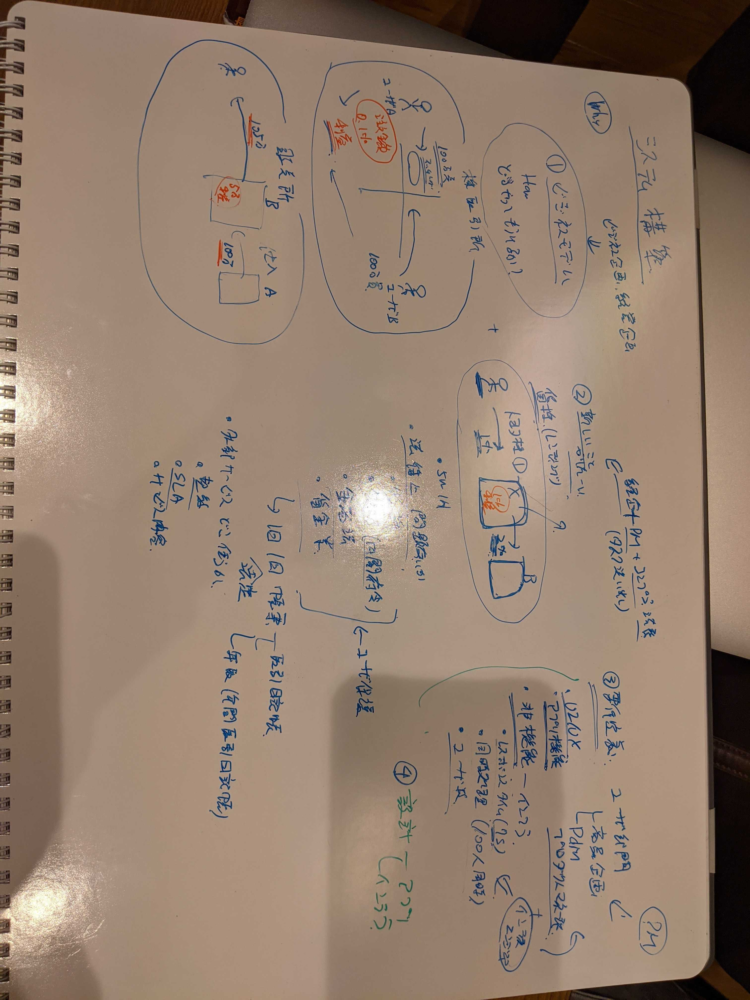
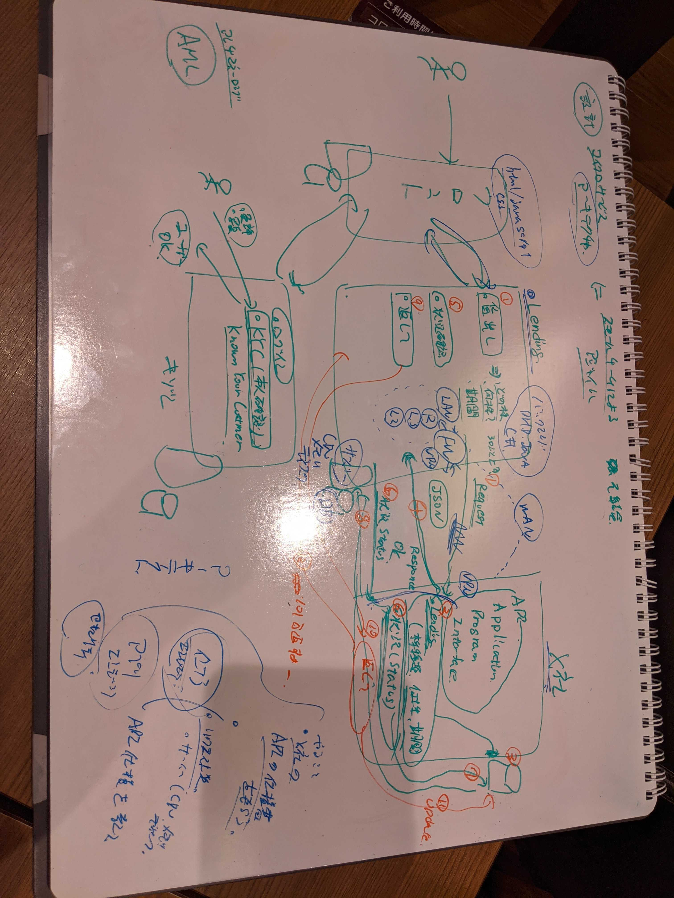
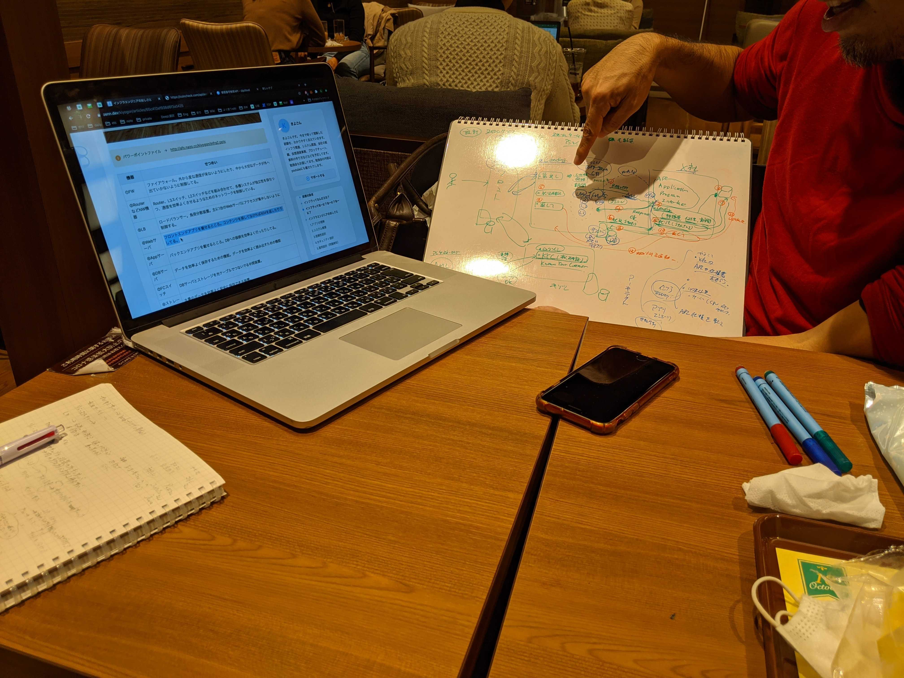

= ネットワーク勉強会
:source-highlighter: highlightjs
:toc: macro
:experimental:
:toc-title: 目次
:figure-caption: 図
:table-caption: 表
:caution-caption: 注意
:important-caption: 重要
:note-caption: 注
:tip-caption: 補足
:warning-caption: 警告
:example-caption: 例
:appendix-caption: 付録
:manname-title: 名前

toc::[]

:sectnums:

== 開催概要

日時：2020/10/26 20:30～

場所：池袋

講師： link:https://twitter.com/fishing_kiyogon[きよごん]

参加者： link:https://twitter.com/yukuri_cana[かなさん] 、link:https://twitter.com/hfh3oa[かおりん]

== 本題に入る前に

=== 機能と非機能の違い
* 機能：機能要件はクライアントにとって絶対に必要な機能

　　例). 申し込み画面、お金を受け取る画面

* 非機能：機能面以外の要件全般。質に関わる部分。

　　例). 同時接続処理数、レスポンス

link:https://hnavi.co.jp/knowledge/blog/functional-requirement/[参考]

=== 基本設計と詳細設計の違い
誤解を恐れずに簡単に言えば、、、

* 基本設計：ユーザが理解出来る設計

* 詳細設計：実装者が理解出来る設計

=== マイクロサービスアーキテクチャ
大きな1つのシステムを作るというよりも小さなサービスを組み合わせるマイクロサービスアーキテクチャが流行っている。

=== イメージ図

== インフラ勉強会
link:https://zenn.dev/kiyogon/articles/65c412ef938d6f3a0425/[インフラエンジニアのおしごと] に沿って進める

=== 質問事項

== おまけ(勉強会風景)

